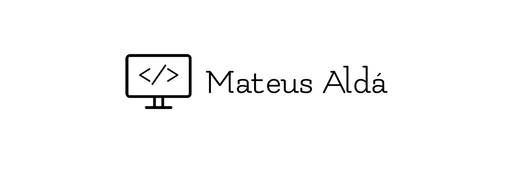

  There is a famous story about a being creating the world using only its words. In this story, said being conjured into existence all sorts of things by just speaking. That's a powerfull picture I always liked to imagine and I think programming is a lot like that. If you use the words correctly you can bring forth the most amazing things. You can create so much with such simple tools. And logic. Oh the logic. How I love my computer for understanding me so well... I just speak my mind, with all the details that i like, and it just knows what i want. Not just that, it empowers me to do what I love, which is creating things. I love to create, to find the path that will get me where I want, to find the most creative or most simple solution to the problems that I face. I know a lot of people dont like it, but I love problem solving, to know where to look, to dont know where to look, to be challenged, to exhaust every possibility, nearly going insane trying to find the problem, and knowing that all I needed was to take a break, come back and instantly find it, but most of all, to see a project finished and see that I did a good job.

Here's a little bit of my journey, my hits and misses while learning and implementing this beautiful technologies.

<h3 align="left">Connect with me:</h3>

<a href="https://linkedin.com/in/mateusalda" target="blank">

LinkedIn
</a>

<h3 align="left">Languages and Tools:</h3>

 
   
  
   
   
   
   
   
   
   
   
   
  
   

&nbsp;
  
<!--    -->

